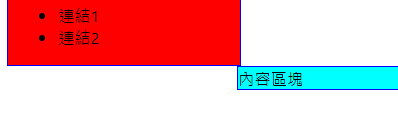
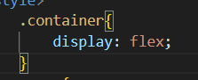
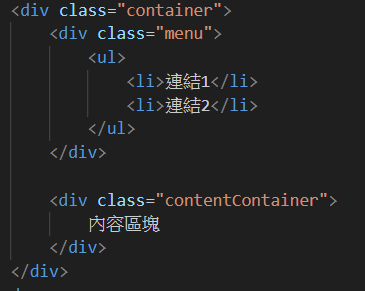
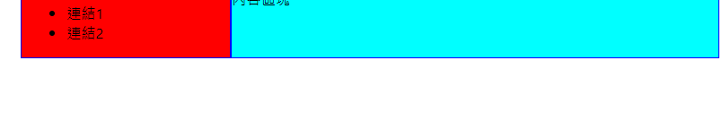
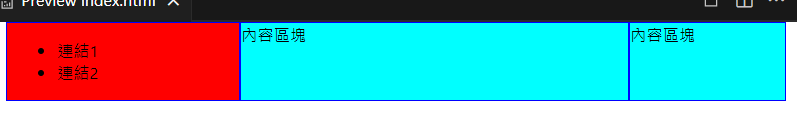

# 第4次作業-作業-HW4
>
>學號：111111211
> 
>姓名：李俊威
> 
>作業撰寫時間：50 (mins，包含程式撰寫時間)
> 
>最後撰寫文件日期：2023/12/24
>

本份文件包含以下主題：(至少需下面兩項，若是有多者可以自行新增)
- [x] 說明內容
- [x] 個人認為完成作業須具備觀念

## 說明程式與內容

1-a 
在原先的css中加入 ***border: 1px solid blue;*** 會使兩個div加上藍色外框，並且因為外框的關喜導致兩邊無法繼續並排。
 

 
1-b 
利用 ***display: flex;***將兩個欲並排的div包覆起來，方可並排表示。
 
 
 

1-c 
實作結果如下
 

## 個人認為完成作業須具備觀念
需具備認真上課的心及查閱資料的耐心，chatgpt固然好用但要學會下問題、判斷它提供的資訊是否準確並用自己的方式將答案表現出來，這樣才是真正的學習到。